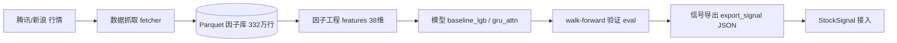

# 🤖 QuantFactor · A股多因子机器学习信号系统

> **CPU-only · 全流程可跑 · 因子里有信息 ≠ 策略能赚钱（主动公开负面结果）**

从 0 到 1 搭建的 A 股多因子机器学习信号系统：并发抓取行情 → 构建因子 → 训练模型 → walk-forward 验证 → 导出可复现信号。整个链路**不依赖 GPU**，单次训练 ≤ 30 分钟，种子固定可复现。

[](https://www.python.org/)
[](https://lightgbm.readthedocs.io/)
[](https://pytorch.org/)
[]()

---

## 📊 数据集与结果（诚实记录）

- **数据集**：1427 只 A 股 / **332 万行** / **38 因子** / 2015–2026；腾讯前复权日线 + 新浪列表并发抓取，增量更新 + Parquet 存储。
- **数据质量体检**：99.0% 标的覆盖至最新交易日——据此**推翻「限流造成大面积缺口」的误判**，避免无效返工**。
- **模型与验证（walk-forward 滚动，每期前 3 年训练）**：

| 模型 | IC | ICIR | 多空夏普 | 备注 |
|---|---|---|---|---|
| LightGBM 基线 | 0.0437 | 0.35 | 1.69（净） | 成本敏感回测含涨跌停与手续费 |
| GRU + Attention | **0.0867** | **0.72** | 1.67 | 2025 年 IC 0.0867 / ICIR 0.72 |
| GRU + Attention（2023） | 0.0747 | 0.69 | 2.04 | 分年度表现最佳 |

- **诚实结论（面试素材）**：主动记录并公开信号**逐年衰减**——分年度 IC 从 2019–2020 的 0.08–0.09 腰斩至 2021 年后的 0.01–0.04；明确区分「因子里有信息」与「策略能赚钱」，**样本外检验完成前不下收益结论**。

---

## 🏗️ 系统架构



---

## 🚀 快速启动

```bash
pip install -r config/requirements.txt   # 或自行安装 lightgbm / torch / pandas
python -m src.training.common --help      # 训练入口
pytest tests/ -q                          # 跑通测试套件
```

核心模块：

| 目录 | 职责 |
|---|---|
| `src/data` | 行情抓取（fetcher/sources）+ Parquet 存储（storage） |
| `src/features` | 因子工程（price_features / event_factor / labels） |
| `src/models` | LightGBM 基线（baseline_lgb）+ GRU·Attention（gru_attn）+ 训练（trainer） |
| `src/backtest` | 向量化回测引擎（含涨跌停/手续费） |
| `src/eval` | IC / ICIR / 多空夏普 评估 |
| `src/signal` | 信号导出 JSON（供 StockSignal 接入） |

---

## 📌 设计原则

- **可复现优先**：固定随机种子，全流程 CPU 可跑，单次训练 ≤ 30 分钟。
- **反粉饰**：信号衰减、样本外未验证的结论一律照实记录，宁可下保守结论。
- **工程化**：数据质量体检前置，避免在「错误的前提」上做无效优化。

> 💡 配套简历见 [校招版 PDF](https://github.com/hzzqq/hzzqq/blob/main/resume_campus.pdf)。
